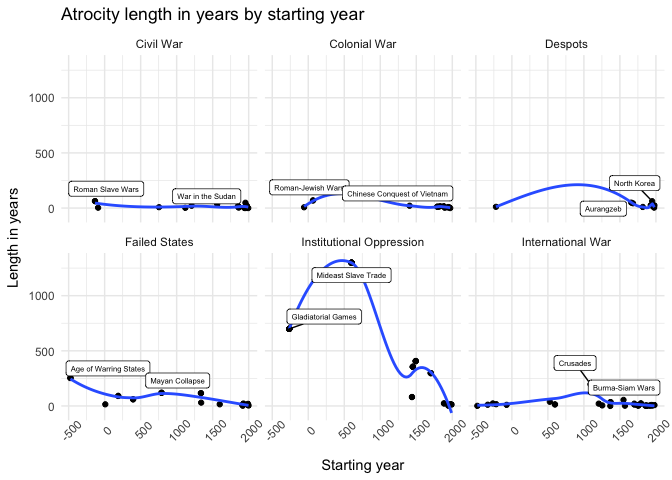
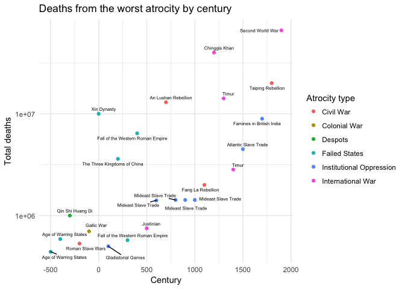
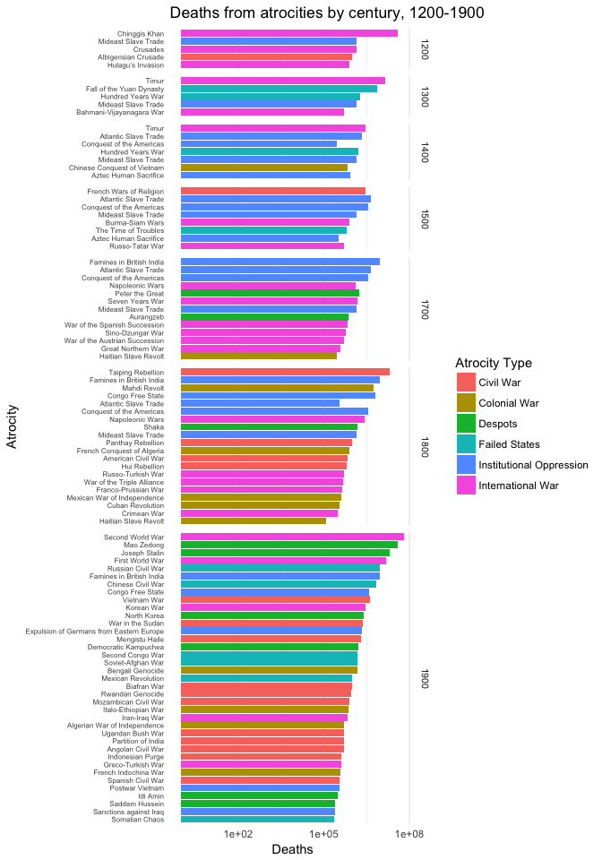
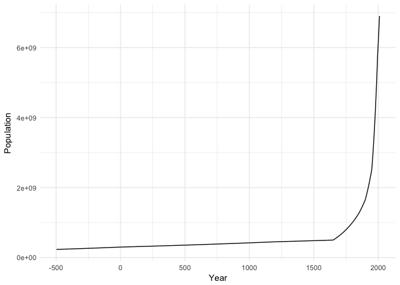
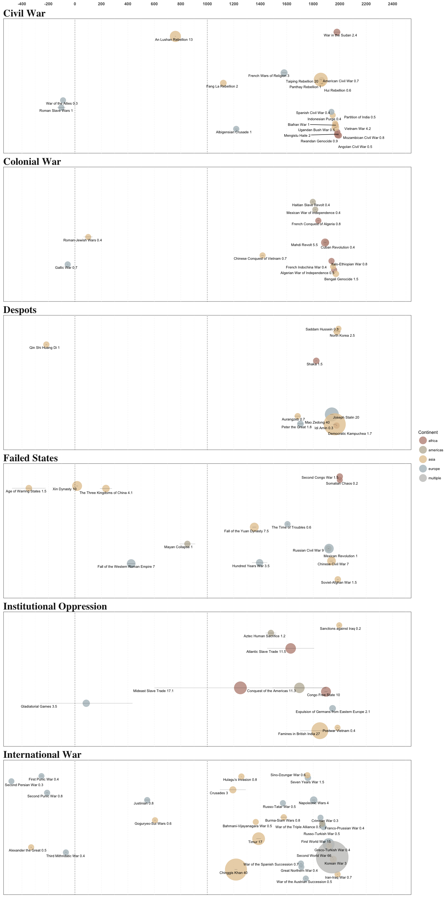

Large-scale atrocities
================
Sara Altman

-   [Read in data from googlesheets](#read-in-data-from-googlesheets)
-   [Atrocities](#atrocities)
-   [Population data](#population-data)
-   [Deaths from atrocities over time](#deaths-from-atrocities-over-time)

This challenge looks at large-scale atrocities over time. The data set is from *The Great Book of Horrible Things* by Matthew White. The Google Sheets data was compiled by Holden Karnofsky as part of his analysis for this blog post: <http://blog.givewell.org/2015/07/08/has-violence-declined-when-large-scale-atrocities-are-systematically-included/#Sec2>, which I recommend reading. Bill Marsh used this same data set to create a visualization for the New York Times (<http://www.nytimes.com/imagepages/2011/11/06/opinion/06atrocities_timeline.html>). Part of this challenge involves recreating this visualization.

### Read in data from googlesheets

**q1.1** Create a`googlesheet` object from the Google Sheets data set found at `data_url`.

``` r
sheet <- gs_url(x = data_url)
```

**q1.2** The original data is far from tidy. Read in the names, start dates, and end dates of all the atrocities. These can be found in the third quadrant. We only want the first, second-to-last, and last columns. Call the resulting tibble `atrocities`.

Hint: look at `gs_read`.

``` r
atrocities <- 
  sheet %>% 
  gs_read(range = cell_cols(cols_atrocities), skip = 18, col_names = FALSE) %>% 
  dplyr::select(atrocity = 1, 
         start_year = 13,
         end_year = 14)
```

**q1.3** Now, read in the fourth quadrant up until (and including) column AP. Each column represents a 100-year period of time. The values represent the number of deaths due to the atrocity listed in column A. Set `col_names` equal to `columns` and keep `verbose` equal to `TRUE` (Don't worry--the column names won't stay numbers for long). Call this tibble `deaths`.

``` r
deaths <- gs_read(sheet, range = cell_cols(cols_deaths), 
                  skip = 18, col_names = column_names)
```

**q1.4** Inspect each tibble and look for anything unusual. Fix any problems you see.

``` r
deaths <-
  deaths %>% 
  mutate(`1600` = ifelse(typeof(`1600`) == "character", 0, `1600`))
```

**q1.5** Bind `atrocities` and `deaths`. Tidy the data and name the resulting tibble atrocities\_tidy. Create a variable `type` that represents the type of an atrocity (you can use the vectors of types given in the parameters section).

Note: You're probably going to end up with a lot of rows where the number of deaths is 0. I filtered them out so that there would be fewer rows and the tibble would be more interpretable, but it's not strictly necessary.

``` r
find_type <- function(atrocity) {
  if (atrocity %in% colonial_wars) {return("colonial war")}
  if (atrocity %in% international_wars) {return("international war")} 
  if (atrocity %in% oppression) {return("institutional oppression")}
  if (atrocity %in% failed_states) {return("failed states")}
  if (atrocity %in% civil_wars) {return("civil war")}
  if (atrocity %in% despots) {return("despots")}
  else {return("NA")}
}

atrocities_tidy <- 
  atrocities %>% 
  bind_cols(deaths) %>% 
  gather(key = "century", value = "deaths", 4:28, convert = TRUE) %>% 
  filter(!(near(deaths, 0))) %>% 
  mutate(type = map_chr(atrocity, find_type))
```

### Atrocities

**q2** Let's look at `atrocities_tidy`. Construct a couple plots that visualize the information. Look at the outliers. What can you conclude?

``` r
atrocities_tidy <-
  atrocities_tidy %>% 
  mutate(length = end_year - start_year,
         type = str_to_title(type)) 

to_label <-
  atrocities_tidy %>% 
  group_by(type) %>% 
  distinct(atrocity, start_year, length) %>% 
  top_n(length, n = 2)
  
  
atrocities_tidy %>% 
  group_by(atrocity) %>% 
  ggplot(aes(start_year, length)) +
  geom_point() +
  geom_smooth(method = loess, se = FALSE) +
  geom_label_repel(aes(label = atrocity), size = 2, color = "black", 
                   nudge_y = 25, data = to_label) +
  labs(x = "Starting year",
       y = "Length in years",
       title = "Atrocity length in years by starting year") +
  facet_wrap(~type) +
  theme_minimal() +
  theme(axis.text.x = element_text(angle = 45))
```



-   Most of the major outliers in terms of length are not wars.
-   The length of non-war atrocities appears to have decreased over time after around 500, with a bump around 1500.
-   The longest atrocity was the Mideast Slave Trade, followed by the gladiatorial games.
-   Civil war lengths haven't changed much across 2000 years. Neither have international war lengths, besides the bump around the crusades.
-   The decline in length of atrocities due to instutional oppression is the most dramatic.

``` r
atrocities_top <-
  atrocities_tidy %>% 
  group_by(atrocity, start_year, end_year, length, type, century) %>% 
  summarise(total = sum(deaths)) %>% 
  group_by(century) %>% 
  filter(near(total, max(total, na.rm = TRUE))) 

atrocities_top %>% 
  ggplot(aes(century, total)) +
  geom_point(aes(color = type)) +
  geom_text_repel(aes(label = atrocity), size = 2) +
  scale_y_log10() +
  scale_color_discrete(name = "Atrocity type") +
  labs(title = "Deaths from the worst atrocity by century",
       y = "Total deaths",
       x = "Century") +
  theme_minimal()
```



-   It looks like the concentration of atrocities is higher after 1500, but this could either be due to better reporting, or just the fact that there are more people now and therefore more conflicts.
-   The total number of deaths from war-atrocities has increased much more than the total number of deaths from non-war atrocities, which makes sense given the changes in weapons and tactics since 500 BC.
-   It's not really that helpful to just look at total deaths, since the population now is much larger than it was in 500BC. I'd like to redo this plot but with percent of population killed instead of total killed.
-   Genghis Khan is surprisingly close to WW2 (in terms of the total variation) given the population change differences between 1100 and the 1930s - 40s.
-   The Mideast Slave Trade was the worst atrocity for four centuries.

``` r
atrocities_tidy %>% 
  filter(century > 1100) %>% 
  ggplot(aes(reorder(atrocity, deaths), deaths, fill = type)) +
  geom_col(position = "dodge") +
  facet_grid(century ~., scales = "free_y", space = "free_y") +
  scale_y_log10() +
  theme_minimal() +
  theme(axis.text.y = element_text(size = 6),
        strip.text = element_text(size = 8),
        panel.grid.major.y = element_blank()) +
  scale_fill_discrete(name = "Atrocity Type") +
  coord_flip() +
  labs(x = "Atrocity",
       y = "Deaths",
       title = "Deaths from atrocities by century, 1200-1900") 
```



### Population data

**q3.1** There's a limit to the conclusions we can draw without population data. You can find population data on the population sheet. Read in the data from the population sheet and store in a tibble. You only need the columns for year and population.

``` r
population <- 
  gs_read(sheet, ws = 3 , range = cell_cols("F:K"), 
                  skip = 11, col_names = FALSE, verbose = FALSE) %>% 
  dplyr::select(year = X1,
         population = X6)
```

    ## Parsed with column specification:
    ## cols(
    ##   X1 = col_integer(),
    ##   X2 = col_integer(),
    ##   X3 = col_integer(),
    ##   X4 = col_number(),
    ##   X5 = col_double(),
    ##   X6 = col_double()
    ## )

**q3.2** Make a quick plot of the population data to check that it makes sense.

``` r
population %>% 
  ggplot(aes(year, population)) +
  geom_line() +
  labs(x = "Year",
       y = "Population") +
  theme_minimal()
```



**q3.3** Now, join the population data with `atrocities_tidy`. Store the result in a new tibble. Think about how you want to deal with the differences in population across the time span of an atrocity.

``` r
#I realized that we don't actually need this population data, but if students want to either try to make the legends of the NY times plot or play around with the data, it could be useful
#I also think either some of the death estimates are off, or some of the population statistics are off
atrocities_pop <-
  atrocities_tidy %>% 
  left_join(population, by = c("start_year" = "year")) %>% 
  rename(population_start = population) %>% 
  left_join(population, by = c("end_year" = "year")) %>% 
  rename(population_end = population)
```

**q3.4** To recreate the plot, we're going to need a variable `total` that represents the total number of deaths due to an atrocity, a variable `percent_killed` that represents the percent of the world's total population killed in the atrocity, a variable `mean_year` that represents the median year of the atrocity, and a variable `percent_killed` that represents the percentage of the population killed by the atrocity. Create these variables.

``` r
find_continent <- function(atrocity) {
  if (atrocity %in% europe) {return("europe")}
  if (atrocity %in% africa) {return("africa")}
  if (atrocity %in% asia) {return("asia")}
  if (atrocity %in% americas) {return("americas")}
  if (atrocity %in% multiple) {return("multiple")}
  else {return("NA")}
}

by_atrocity <-
  atrocities_pop %>% 
  group_by(atrocity, start_year, end_year, length, 
           population_start, population_end, type) %>%
  summarise(total_deaths = sum(deaths, na.rm = TRUE)) %>% 
  mutate(mean_year = mean(c(start_year, end_year), na.rm = TRUE),
         mean_population = mean(c(population_start, population_end), na.rm = TRUE),
         percent_killed = (total_deaths / mean_population)*100,
         continent = map_chr(atrocity, find_continent))
```

### Deaths from atrocities over time

For this question, recreate (or improve upon) this plot from the New York Times: <http://www.nytimes.com/imagepages/2011/11/06/opinion/06atrocities_timeline.html>.

**q3.4** Recreate the New York Times plot. This doesn't have to be exact--the original author didn't use R to create the visualization.

``` r
by_atrocity_rf <-
  by_atrocity %>% 
       mutate(death_millions = round(total_deaths / 1000000, 1),
       label = str_c(atrocity, death_millions, sep = " "),
       y_pos = (end_year %% 250)*7)

for_labels_right <- 
  by_atrocity_rf %>% 
  filter(mean_year >= 1900)

for_labels_left <-
  by_atrocity_rf %>% 
  filter(mean_year < 1900)
  

by_atrocity_rf %>% 
  ggplot(aes(mean_year, y_pos, 
             size = total_deaths, color = continent)) +
  geom_point(alpha = .8) +
  geom_text_repel(aes(end_year, y_pos, label = label), 
                  size = 3, segment.size = .5, color = "black", 
                  nudge_x = 1, nudge_y = -30, inherit.aes = FALSE, 
                  min.segment.length = unit(2, "lines"),
                  data = for_labels_right) +
  geom_text_repel(aes(start_year, y_pos, label = label), 
                  size = 3, segment.size = .5, color = "black",
                  nudge_x = -3, nudge_y = -30, inherit.aes = FALSE, 
                  min.segment.length = unit(2, "lines"),
                  data = for_labels_left) +
  geom_segment(aes(x = start_year, xend = end_year, 
                   y = y_pos, yend = y_pos), 
               size = .1, inherit.aes = FALSE) +
  geom_vline(xintercept = 0, linetype = "dotted") +
  geom_vline(xintercept = 1000, linetype = "dotted") +
  facet_wrap(~type, ncol = 1, scales = "free_y") +
  scale_x_continuous(breaks = seq(-400, 2600, 200), position = "top") +
  scale_y_continuous(trans = "reverse", labels = NULL) +
  scale_color_manual(values = fill_continent_colors) +
  scale_radius(range = c(6, 36)) +
  coord_cartesian(ylim = c(-100, 1900), xlim = c(-400, 2400)) +
  theme_minimal() +
  guides(size = FALSE,
         color = guide_legend(title = "Continent", override.aes = list(size = 8))) +
  theme_minimal() +
  theme(
   # aspect.ratio = .15,
    panel.grid.major.x = element_line(linetype = "dotted"),
    panel.grid.minor.x = element_line(linetype = "dotted"),
    panel.grid.major.y = element_blank(),
    panel.grid.minor.y = element_blank(),
    strip.text = element_text(size = 24, family = "Times", face = "bold", hjust = 0),
    axis.text.x = element_text(size = 10, face = "bold"),
    panel.background = element_rect(fill = NA, color = "black")
  ) +
  labs(x = NULL,
       y = NULL) 
```


